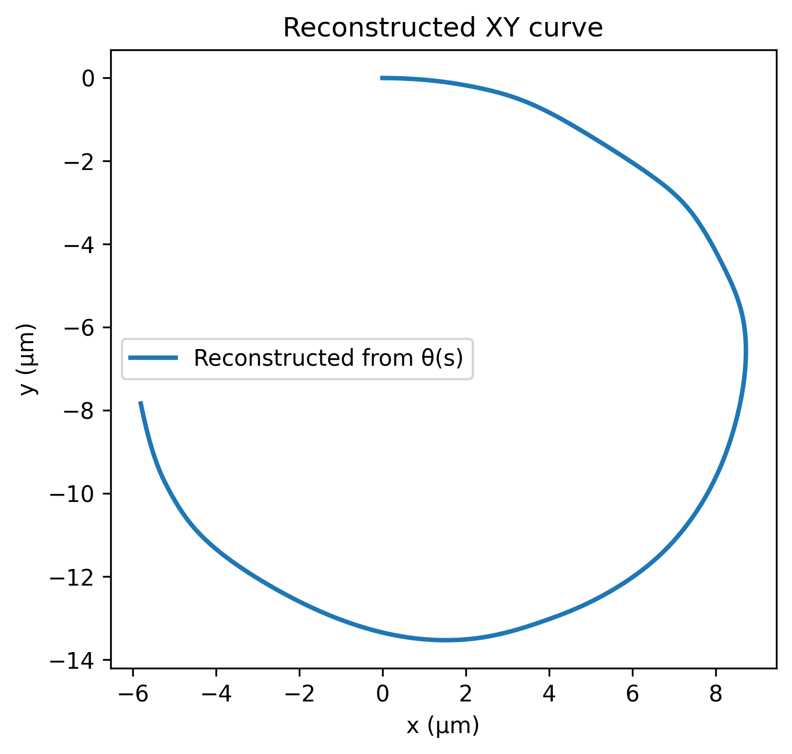
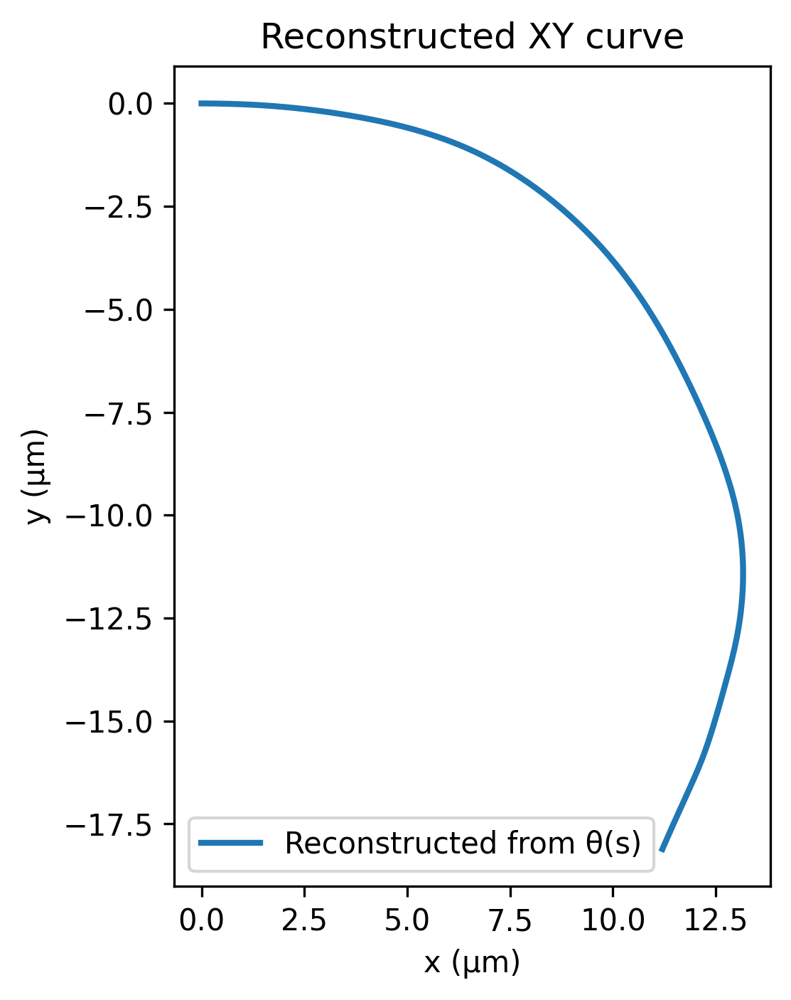
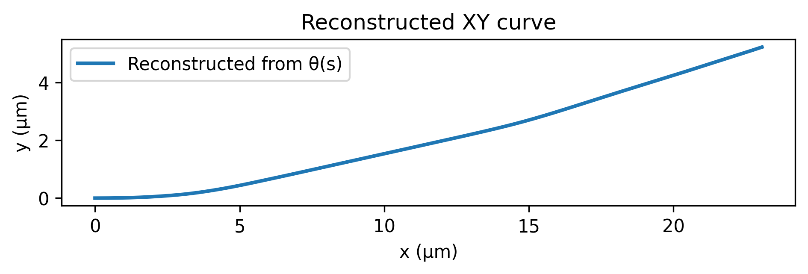
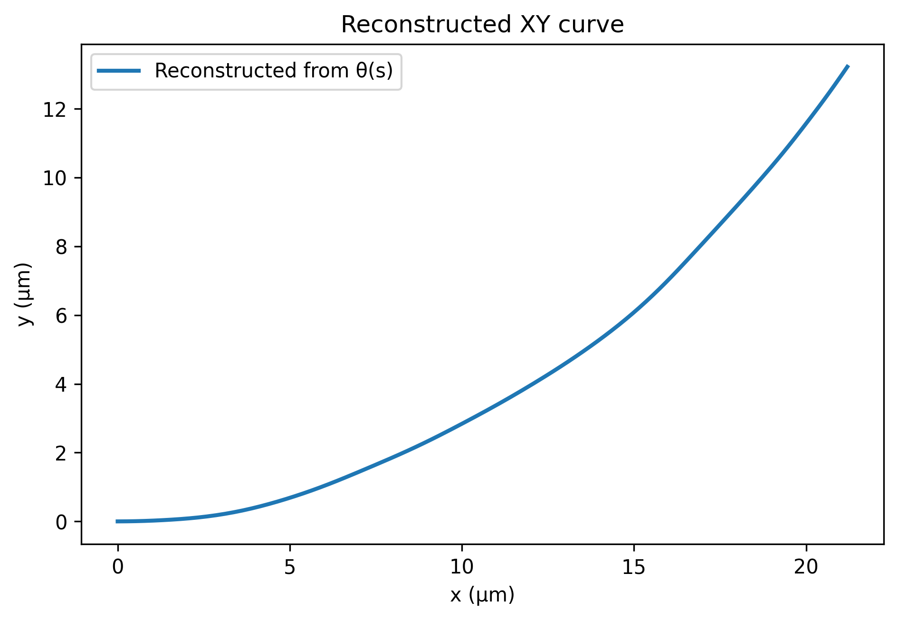
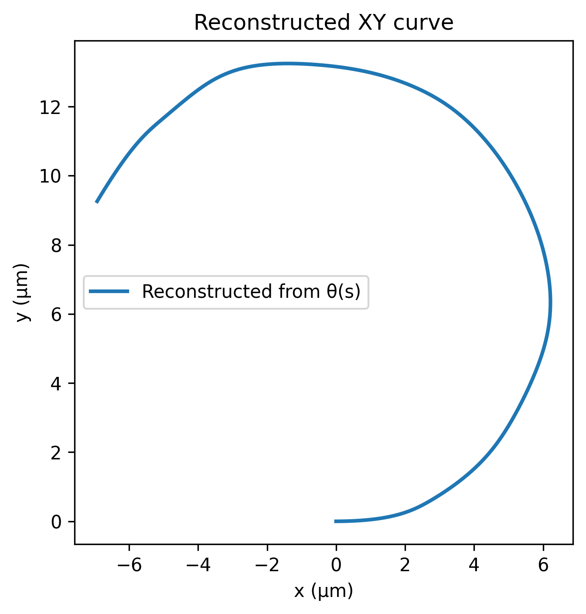

# kappa-bend-model

End-to-end pipeline that learns **tip angle** and **full curvature shape κ(s)** from ImageJ **Kappa** data, then integrates to **θ(s)** and reconstructs **XY** for thin-strip bending.

**Quick links:** [Install](#install) · [Data](#data) · [Train](#train) · [Predict](#predict) · [Outputs](#outputs) · [Examples](#examples)

---

  
   
  Curvature map example (20 °C)

---

## What it does

- Parses curvature CSVs exported from ImageJ/Fiji **Kappa**.
- Learns **θ_tip** regression and a **PCA + regression** model for full κ(s).
- Integrates κ(s) → θ(s) and reconstructs XY.
- Exports metrics and publication-ready figures.

## Data

- Place training CSVs under `train/` (and optional test CSVs under `test/`).
- Recommended columns: `Point Curvature (um-1)`, `Point Curvature Sign`, `X-Coordinate`, `Y-Coordinate`.
- Folder/file names should include tokens like `5vs1` (ratio 5:1) and `20C` (temperature 20 °C).

## Examples

<table>
  <tr>
    <td align="center">
       
      ratio = 5:1 · temp = 20 °C
    </td>
    <td align="center">
       
      ratio = 5:1 · temp = 30 °C
    </td>
    <td align="center">
       
      ratio = 5:1 · temp = 40 °C
    </td>
    <td align="center">
       
      ratio = 5:1 · temp = 50 °C
    </td>
    <td align="center">
       
      ratio = 5:1 · temp = 60 °C
    </td>
  </tr>
</table>
